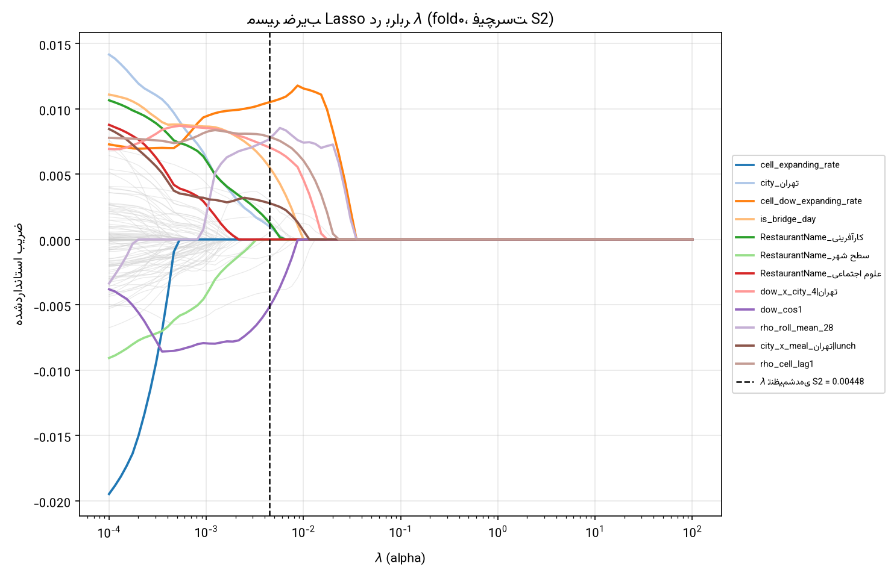
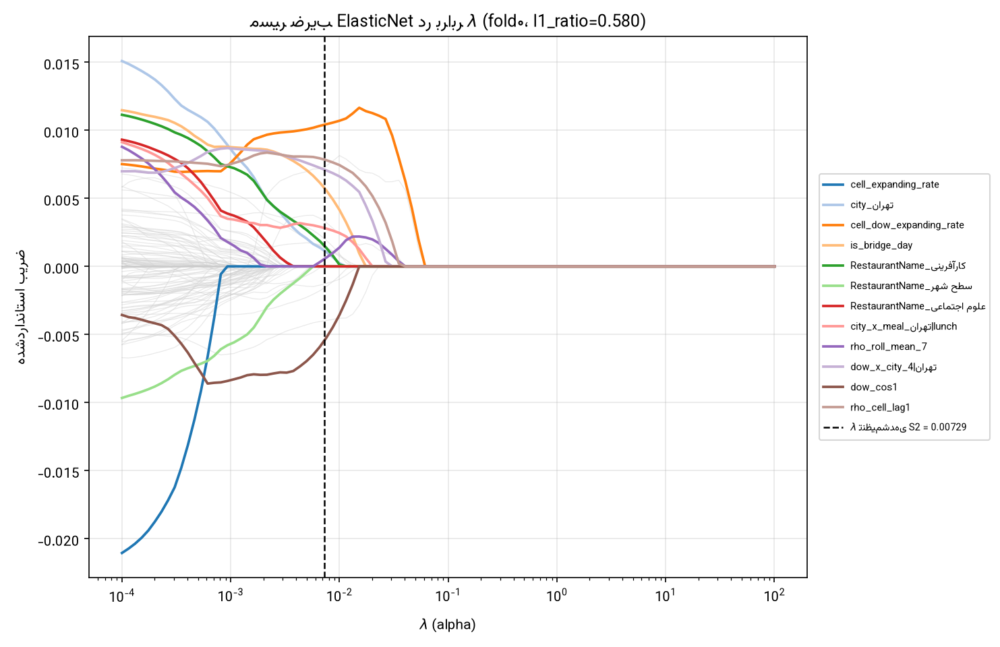

# مسیر ضریب Lasso/ElasticNet در برابر λ + فیچرهای بازمانده — بند 7.5.4

> فیچرست: `_feature_cols_s2()` (۱۵۴ ستون بعد از یک‌هات) — نه فیچرست باگ‌دار واقعاً-اجراشده‌ی S2 (یافته‌ی ۳۴)؛ بند بالای ماژول توضیح می‌دهد چرا. λ از `S2_tuning_F01.json` (تنظیم‌شده روی همان فیچرست باگ‌دار — همچنان بهترین تخمین موجود از مقیاس منظم‌سازی معقول).

## `lasso` — λ=0.00448

از 154 ستون طراحی (بعد از یک‌هات `_feature_cols_s2()`): **26** حداقل در یک fold زنده ماندند، **11** در هر ۵ fold (اجماع کامل).

### وضعیت خوشه‌ی هم‌خط بند 7.5.3 (VIF ۲۰۰۰-۱۰۰۰۰)

| فیچر | زنده در چند fold از ۵ |
|---|---|
| `cell_expanding_rate` | 0 |
| `cell_shrunk_rate` | 5 |
| `cell_dow_expanding_rate` | 5 |
| `cell_dow_shrunk_rate` | 0 |
| `food_expanding_rate` | 0 |
| `food_shrunk_rate` | 0 |

**2 از 6 عضو خوشه در دست‌کم یک fold زنده ماندند.**

### ۱۵ فیچر با بیشترین اجماع (زنده در بیشترین تعداد fold)

| فیچر | زنده در چند fold |
|---|---|
| `cell_dow_expanding_rate` | 5 |
| `cell_shrunk_rate` | 5 |
| `dow_cos1` | 5 |
| `city_تهران` | 5 |
| `day_shock_lag1` | 5 |
| `rho_cell_lag1` | 5 |
| `log_res` | 5 |
| `res_vs_dow_history` | 5 |
| `dow_x_city_4|تهران` | 5 |
| `is_bridge_day` | 5 |
| `res_vs_history` | 5 |
| `day_of_month` | 4 |
| `log_daily_total_res` | 4 |
| `rho_roll_mean_28` | 4 |
| `dow_x_city_2|تهران` | 3 |

## `elasticnet` — λ=0.00729

از 154 ستون طراحی (بعد از یک‌هات `_feature_cols_s2()`): **27** حداقل در یک fold زنده ماندند، **11** در هر ۵ fold (اجماع کامل).

### وضعیت خوشه‌ی هم‌خط بند 7.5.3 (VIF ۲۰۰۰-۱۰۰۰۰)

| فیچر | زنده در چند fold از ۵ |
|---|---|
| `cell_expanding_rate` | 0 |
| `cell_shrunk_rate` | 5 |
| `cell_dow_expanding_rate` | 5 |
| `cell_dow_shrunk_rate` | 0 |
| `food_expanding_rate` | 0 |
| `food_shrunk_rate` | 0 |

**2 از 6 عضو خوشه در دست‌کم یک fold زنده ماندند.**

### ۱۵ فیچر با بیشترین اجماع (زنده در بیشترین تعداد fold)

| فیچر | زنده در چند fold |
|---|---|
| `cell_dow_expanding_rate` | 5 |
| `cell_shrunk_rate` | 5 |
| `city_تهران` | 5 |
| `dow_cos1` | 5 |
| `day_shock_lag1` | 5 |
| `res_vs_history` | 5 |
| `rho_cell_lag1` | 5 |
| `log_res` | 5 |
| `res_vs_dow_history` | 5 |
| `is_bridge_day` | 5 |
| `dow_x_city_4|تهران` | 5 |
| `log_daily_total_res` | 4 |
| `day_of_month` | 4 |
| `rho_roll_mean_28` | 4 |
| `dow_x_city_2|تهران` | 3 |
