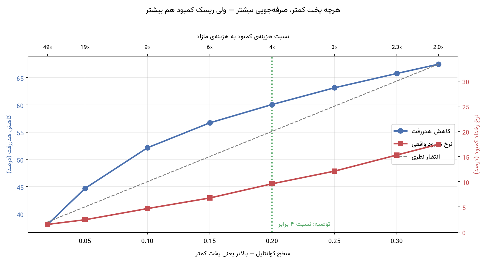

# تحلیل حساسیت τ

> **تعهد بند ۲-۲ سند تعریف مسئله و بند ۱.۲ WBS**، سررسید: پس از EDA و پیش از قفل
> پروتکل. تولید خودکار با `python -m src.run_protocol`.

## چارچوب

خروجی عملیاتی: $\widehat{CookQty} = \lceil Res \times (1-\hat\rho_\tau) \rceil$

کمبود یعنی $\widehat{CookQty} < Recv$، یعنی $\hat\rho_\tau > \rho$. اگر
$\hat\rho_\tau$ واقعاً کوانتایل $\tau$ توزیع شرطی باشد، آنگاه
$P(\rho < \hat\rho_\tau) = \tau$ — یعنی **در حالت کالیبره‌ی کامل، $\tau$ خودش
نرخ کمبود مورد انتظار است**. فاصله‌ی ستون «نرخ کمبود» از ستون «τ» سنجه‌ی
کالیبراسیون است.

## ⚠️ کدام فرمول نیوزوندور؟ (منشأ یک ابهام رایج)

فرکتایل کلاسیک نیوزوندور $C_u/(C_u+C_o)$ است — ولی آن در فضای **تقاضا** تعریف
می‌شود. خروجی این مدل کوانتایلی از **نرخ عدم‌دریافت $\rho$** است، و $\rho$ متمم
تقاضاست: $D = Res\,(1-\rho)$. پس:

$$P(D \le Q) = P(\rho \ge \hat\rho_\tau) = 1-\tau
\quad\Longrightarrow\quad \tau^{*}_{\rho} = \frac{C_o}{C_u+C_o}$$

| $C_u/C_o$ | فرکتایل **تقاضا** (کلاسیک) | $\tau_\rho$ (خروجی ما) |
|---|---|---|
| ۲× | ۰.۶۷ | **۰.۳۳** |
| ۴× | ۰.۸۰ | **۰.۲۰** |
| ۹× | ۰.۹۰ | **۰.۱۰** |

**تأیید عددی** (شبیه‌سازی مستقیم نیوزوندور با $C_u=4C_o$ روی ۴۰۰ هزار نمونه):
کمینه‌ی هزینه دقیقاً در $\tau_\rho = 0.20$ رخ می‌دهد، و در همان نقطه
$P(\text{تقاضا} \le \text{پخت}) = 0.80$ — یعنی هر دو فرمول یک تصمیم واحد می‌دهند،
فقط در دو فضای مختلف بیان شده‌اند.

> ⚠️ نسخه‌ی اولیه‌ی سند تعریف مسئله فرمول را در فضای تقاضا نوشته بود ولی τ را در
> فضای $\rho$ به کار می‌برد. این ناسازگاری در ۲۰۲۶-۰۸-۱۴ تصحیح شد (ردیف ۳۶
> `decision_log`). عددِ پیش‌فرض $\tau=0.10$ درست بود؛ فقط فرمولِ کنارش غلط بود.

## چارچوب محاسبه

**معادل نیوزوندور:** $\tau = C_o/(C_u+C_o)$، و معکوسش $C_u/C_o = (1-\tau)/\tau$.
ستون «$C_u/C_o$ معادل» در جدول زیر یعنی: *اگر* مدیریت سلف هزینه‌ی کمبود را این
چند برابر هزینه‌ی مازاد بداند، آن ردیف انتخاب بهینه است. پس جدول را می‌توان
**از ستون دوم** خواند، نه از ستون اول — که برای تصمیم‌گیرنده طبیعی‌تر است.

شبکه تا $\tau=1/3$ (یعنی $C_u = 2C_o$) کشیده شده تا کل دامنه‌ی محتمل کسب‌وکاری
پوشش داده شود. ردیف ⬅️ برآورد ذی‌نفع پروژه است ($C_u \approx 4C_o$).

**مبنا:** خط پایه‌ی B3 (کوانتایل تجربی گروهی)، روی walk-forward ۵ fold.

## نتایج

| τ | **$C_u/C_o$ معادل** | ٪ کاهش هدررفت | نرخ کمبود مشاهده‌شده | انحراف از τ | پرس کمبود | پرس مازاد |
|---|---|---|---|---|---|---|
| **0.020** | **49.0×** | 38.1% | 1.5% | -0.5% | 281 | 48,627 |
| **0.050** | **19.0×** | 44.7% | 2.4% | -2.6% | 483 | 42,743 |
| **0.100** | **9.0×** | 52.1% | 4.7% | -5.3% | 928 | 36,309 |
| **0.150** | **5.7×** | 56.7% | 6.8% | -8.2% | 1,397 | 32,431 |
| **0.200** | **4.0×** ⬅️ | 60.1% | 9.6% | -10.4% | 1,997 | 29,541 |
| **0.250** | **3.0×** | 63.1% | 12.1% | -12.9% | 2,712 | 26,993 |
| **0.300** | **2.3×** | 65.8% | 15.3% | -14.7% | 3,501 | 24,788 |
| **0.333** | **2.0×** | 67.5% | 17.4% | -15.9% | 4,135 | 23,378 |

## تحلیل حاشیه‌ای — نرخ مبادله در هر گام

| گام | پرس مازاد صرفه‌جویی‌شده | پرس کمبود اضافه | **نرخ مبادله** | صرفه دارد اگر |
|---|---|---|---|---|
| 0.02 → 0.05 | 5,884 | 202 | **29.1×** | $C_u < 29.1\,C_o$ |
| 0.05 → 0.10 | 6,434 | 445 | **14.5×** | $C_u < 14.5\,C_o$ |
| 0.10 → 0.15 | 3,878 | 469 | **8.3×** | $C_u < 8.3\,C_o$ |
| 0.15 → 0.20 | 2,890 | 600 | **4.8×** | $C_u < 4.8\,C_o$ |
| 0.20 → 0.25 | 2,548 | 715 | **3.6×** | $C_u < 3.6\,C_o$ |
| 0.25 → 0.30 | 2,205 | 789 | **2.8×** | $C_u < 2.8\,C_o$ |
| 0.30 → 0.33 | 1,410 | 634 | **2.2×** | $C_u < 2.2\,C_o$ |

## تفسیر

### ۱. نرخ مبادله به‌سرعت بدتر می‌شود

از ۰.۰۲ به ۰.۰۵، هر پرس کمبود اضافه ۲۹ پرس مازاد صرفه‌جویی می‌کند. از ۰.۱۵ به ۰.۲۰
این عدد به ۴.۸ می‌افتد. یعنی سود نهایی افزایش $\tau$ به‌سرعت ته می‌کشد.

### ۲. ⭐ تحلیل تجربی، فرمول نیوزوندور را تأیید می‌کند

فرمول نظری $\tau^{*} = C_o/(C_u+C_o)$ می‌گوید اگر $C_u = 9\,C_o$ باشد،
$\tau^{*}=0.10$. تحلیل حاشیه‌ای مستقل از آن به همین نتیجه می‌رسد:

- گام ۰.۰۵→۰.۱۰ نرخ مبادله‌ی **۱۴.۵×** دارد ⇒ با $C_u=9C_o$ **صرفه دارد** (۱۴.۵ > ۹)
- گام ۰.۱۰→۰.۱۵ نرخ مبادله‌ی **۸.۳×** دارد ⇒ با $C_u=9C_o$ **صرفه ندارد** (۸.۳ < ۹)

پس نقطه‌ی بهینه دقیقاً بین این دو، یعنی **$\tau \approx 0.10$** است — هم‌راستا با
پیش‌فرض سند تعریف مسئله. این توافق دو مسیر مستقل، اعتماد به عدد را بالا می‌برد.

### ۳. ⚠️ مدل محافظه‌کارتر از ادعایش است (یافته‌ی کالیبراسیون)

نرخ کمبود مشاهده‌شده **همیشه کمتر از $\tau$** است و شکاف با $\tau$ بزرگ‌تر می‌شود
(از −۰.۵ واحد درصد در ۰.۰۲ تا −۱۰.۴ در ۰.۲۰). یعنی رابطه‌ی نظری «$\tau$ = نرخ کمبود»
در عمل برقرار نیست و مدل بیش از آنچه ادعا می‌کند غذا می‌پزد.

دلیل: کوانتایل در سطح **گروه** برآورد می‌شود ولی کمبود در سطح **ردیف** سنجیده
می‌شود، و توزیع درون‌گروهی ناهم‌واریانس است (F06، F07). این خطا در جهت **امن**
است، ولی یعنی $\tau$ را نمی‌توان مستقیماً به‌عنوان «ریسک کمبود» به مدیریت اعلام کرد
— باید عدد **مشاهده‌شده** گزارش شود.

## توصیه

⚠️ **این یک تصمیم سیاستی است، نه فنی.** آنچه این تحلیل فراهم می‌کند، مبادله‌ی
کمّی‌شده است تا تصمیم آگاهانه گرفته شود.

### گزینه‌ی کسب‌وکاری: $C_u \approx 4C_o$ ⇒ $\tau = 0.20$

برآورد ذی‌نفع پروژه این است که هزینه‌ی کمبود حدود **۴ برابر** هزینه‌ی مازاد است.
طبق رابطه‌ی نیوزوندور این به $\tau = 0.20$ می‌افتد:

| | مقدار |
|---|---|
| کاهش هدررفت | **۶۰.۱٪** |
| نرخ کمبود واقعی | **۹.۶٪** |
| نرخ مبادله‌ی گام بعدی | ۳.۶× (کمتر از ۴ ⇒ **نقطه‌ی توقف**) |

**تأیید مستقل:** تحلیل حاشیه‌ای بدون استفاده از فرمول نیوزوندور به همین نقطه
می‌رسد — گام ۰.۱۵→۰.۲۰ نرخ مبادله‌ی **۴.۸×** دارد (>۴ ⇒ صرفه دارد) و گام
۰.۲۰→۰.۲۵ نرخ **۳.۶×** (<۴ ⇒ صرفه ندارد). یعنی $\tau=0.20$ دقیقاً همان نقطه‌ای
است که مبادله از صرفه می‌افتد — دو مسیر مستقل بدون هماهنگی روی یک عدد
توافق دارند.

### گزینه‌ی محافظه‌کارانه: $\tau = 0.05$

سند تعریف مسئله (بند ۲-۲) اولویت را صریحاً «نادر ماندن کمبود» گذاشته است.
اگر آن اولویت بر برآورد هزینه مقدم باشد:

| | مقدار |
|---|---|
| کاهش هدررفت | ۴۴.۷٪ |
| نرخ کمبود واقعی | **۲.۴٪** |

### مقایسه و جمع‌بندی

| | $\tau=0.05$ | $\tau=0.20$ | تفاوت |
|---|---|---|---|
| کاهش هدررفت | ۴۴.۷٪ | ۶۰.۱٪ | **+۱۵.۴ واحد** |
| نرخ کمبود | ۲.۴٪ | ۹.۶٪ | **+۷.۲ واحد** |
| پرس مازاد صرفه‌جویی‌شده | ۴۲٬۷۴۳ | ۲۹٬۵۴۱ | ۱۳٬۲۰۲ پرس کمتر مازاد |
| پرس کمبود | ۴۸۳ | ۱٬۹۹۷ | ۱٬۵۱۴ پرس بیشتر کمبود |

بین این دو، هر پرس کمبود اضافه **۸.۷ پرس** مازاد صرفه‌جویی می‌کند — که با
$C_u = 4C_o$ کاملاً به‌صرفه است (۸.۷ > ۴).

**توصیه‌ی نهایی: $\tau = 0.20$**، مشروط به تأیید مدیریت سلف که نسبت $C_u/C_o$
واقعاً حدود ۴ است. اگر مدیریت ریسک کمبود را فراتر از هزینه‌ی مستقیمش بداند
(مثلاً اثر اعتباری یا نارضایتی دانشجو)، نسبت مؤثر بالاتر می‌رود و ردیف
متناظرش در جدول بالا مستقیماً خوانده می‌شود.

⚠️ **هشدار کالیبراسیون:** ستون «نرخ کمبود مشاهده‌شده» را به مدیریت اعلام کنید،
نه خودِ $\tau$ را. در $\tau=0.20$ نرخ کمبود واقعی ۹.۶٪ است نه ۲۰٪ — مدل
محافظه‌کارتر از ادعای نظری‌اش عمل می‌کند (توضیح در بخش تفسیر).
